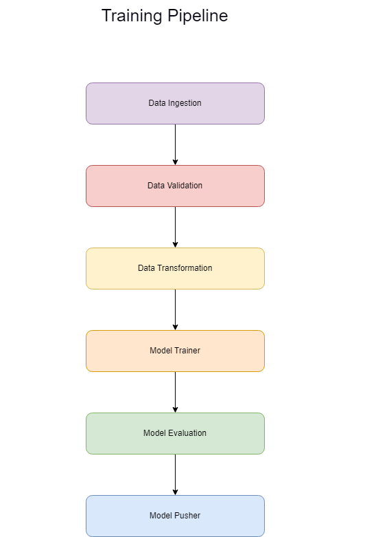
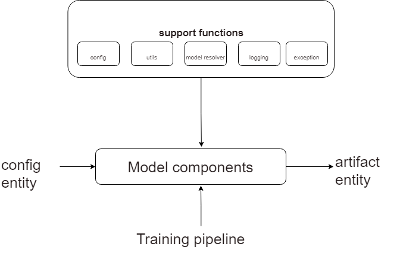
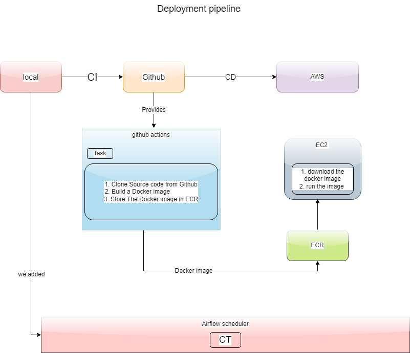

# About the Project


[Dataset](https://archive.ics.uci.edu/ml/datasets/APS+Failure+at+Scania+Trucks)


### Problem statement :
```
1. The system in focus is the Air Pressure system (APS) which generates pressurized air that are utilized in various functions in a truck, such as braking and gear changes. The datasets positive class corresponds to component failures for a specific component of the APS system. The negative class corresponds to trucks with failures for components not related to the APS system.

2. The problem is to reduce the cost due to unnecessary repairs. So it is required to minimize the false predictions.
```

```
3. The total cost of a prediction model the sum of Cost_1 multiplied by the number of Instances with type 1 failure and Cost_2 with the number of instances with type 2 failure, resulting in a Total_cost. In this case Cost_1 refers to the cost that an unnessecary check needs to be done by an mechanic at an workshop, while Cost_2 refer to the cost of missing a faulty truck, which may cause a breakdown.

4. Total_cost = Cost_1 * No_Instances + Cost_2 * No_Instances.

5. From the above problem statement we could observe that, we have to reduce false positives and false negatives. More importantly we have to reduce false negatives, since cost incurred due to false negative is 50 times higher than the false positives.
```


### Challenges and other objectives

1. Need to Handle many Null values in almost all columns
2. No low-latency requirement.
3. Interpretability is not important.
4. misclassification leads the unecessary repair costs.

- ## Training Pipeline

<p align="center">
  
</p>


- ## How it is working 

<p align="center">
  
</p>


- ## Deployment pipeline
<p align="center">
  
</p>


- ## Demo

[](https://youtu.be/YrYIdsYX0HM)

